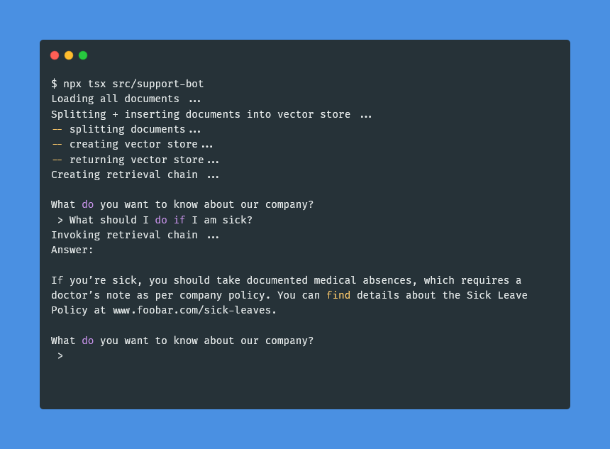
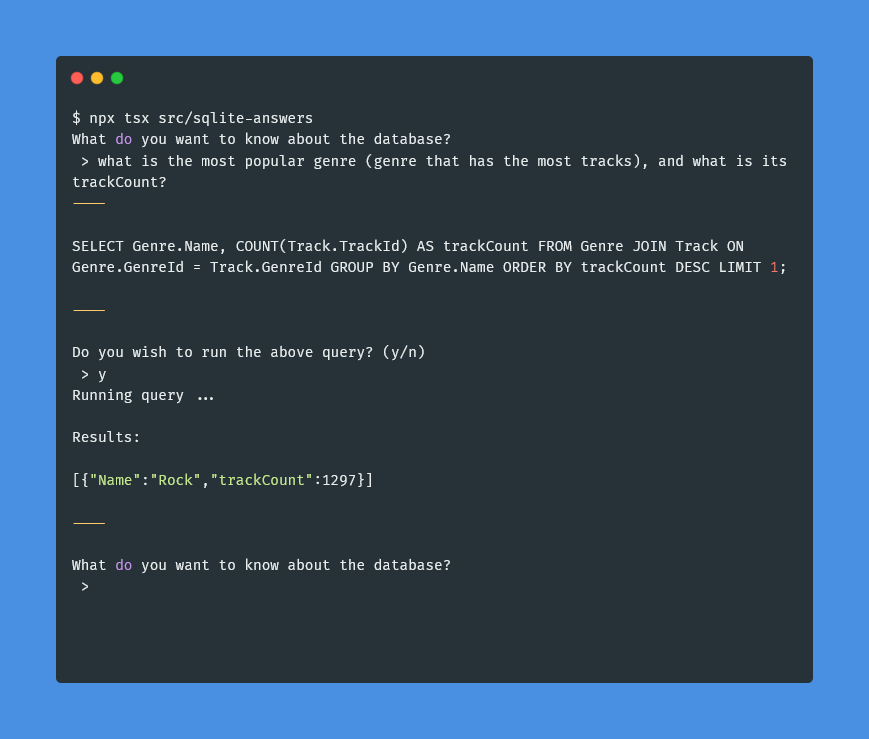

# Langchain JS Recipes
Simple projects built with Langchain JS, for educational copy-pasting/referencing

## First time setup
The project assumes you have a working local Ollama setup, and that gemma3 has been made available on that Ollama setup.

1. Install Ollama: https://ollama.com/download
2. Run `ollama run gemma3` at least once to setup gemma3
3. Run `ollama pull mxbai-embed-large` to setup Ollama embeddings for RAG
4. Run `npm ci` in this repo's root to install necessary Node packages

## Project Legend
1. Chatbot
   - `npx tsx src/chatbot`
   - A basic chatbot that continously takes user input and returns responses from an LLM
   - 

2. Resume Parser
   - `npx tsx src/resume-parser`
   -  An intelligent resume parser, that takes an unstructured document (e.g: a PDF) and returns a structured JSON describing a candidate (e.g: an object with fields such as 'name', 'email', 'workExperience', 'education', etc), with full type validation via Zod.
   - 

3. Support Bot
   - `npx tsx src/support-bot`
   - A basic support chatbot that uses RAG (Retrieval-Augmented Generation) to answer employee questions (e.g: "What do I do if I'm sick"?, "Who is the leader for the IT department"?, etc) using context from "company support documents".
   - 

4. SQlite Answers
   - `npx tsx src/sqlite-answers`
   -  A simple Q&A system for an SQLite database. Ask it questions about the database in plain English, and it will generate + execute SQL to answer you.
   - 
